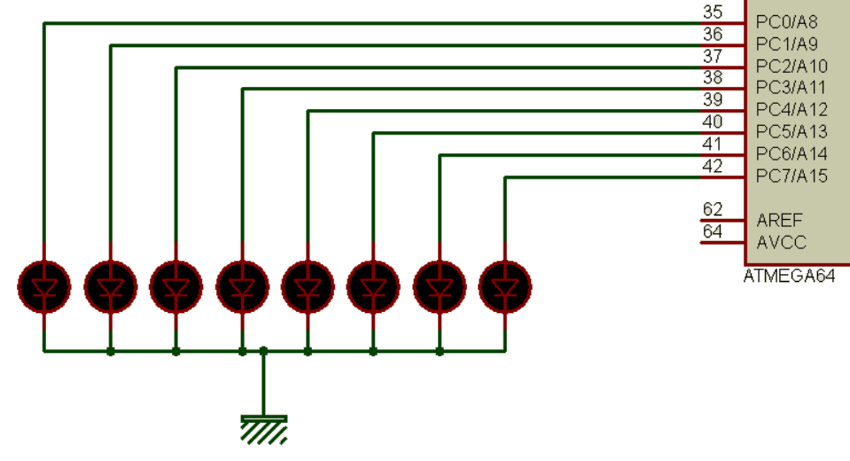
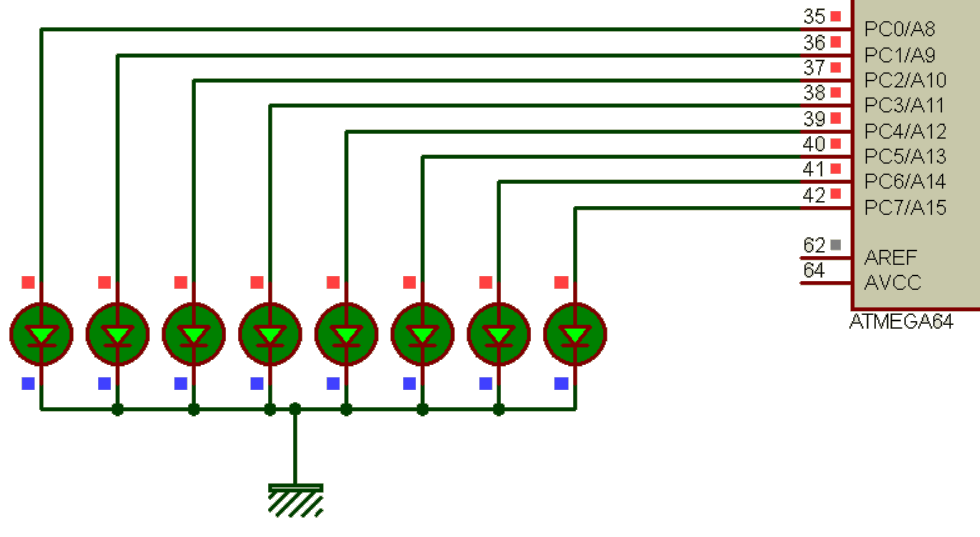

# Toggle 8 LED with PORTC in Atmega64
Question: By creating a delay of one second, write a program that will change the status of all PORTC pins once every second.
Show the toggle of PORTC with LEDs.
Change the program above so that the speed of changing the state of PORTC  is toggled increase and decrease again. Do this alternately.

Answer:

After 1 second:
